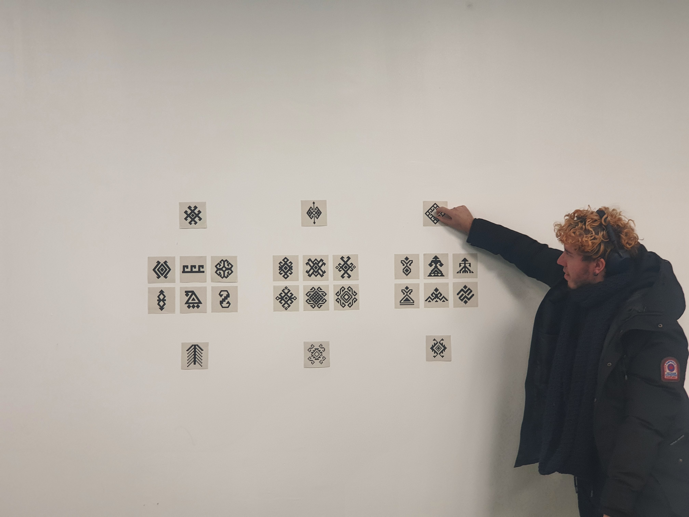

# Les origines numérisées

**Comment la prolongation des arts traditionnels du monde turcique perdure à travers une pratique numérique ?**

Je me questionne sur comment les arts traditionnels du monde turcique se font perdurer à travers une pratique numérique. Mes recherches s’appuient sur les arts décoratifs qu’on peut retrouver dans les différents peuples turcs et de ce qui en a perduré jusqu’à nos jours. De plus, avec l'arrivée de la technologie, je souhaite entrelacer le traditionnel au numérique et par la suite observer comment cette culture se développe sous un nouveau registre. 
Ce peuple né dans les steppes d’Asie centrale, plus précisément dans les montagnes d’Altai 3000 avant J-C, a développé sa propre manière de vivre. Il est essentiel de comprendre la naissance d’une culture et sa diffusion à travers d’autres peuples. L’art, les traditions, les gènes ou le dialecte proviennent d’une même racine turque qui se sont par la suite propagé dans des peuples dépassant le continent asiatique.

### Compétences
Je travaille beaucoup sur l’interactivité sur de l’objet 3D, la visualisation d’un objet en réalité augmentée et sur du code créatif.

**Coding** 
10/20, J'ai encore du mal à comprendre le langage du code mais je peux quand même faire des réalisations en code. 

**GIT ET VERSIONNING**
0/20, Connaît pas

**INTERACTIVITÉ ET RENDU TEMPS RÉEL**
12/20, Je pense y arriver pour des projets dans unity mais je peux avoir du mal pour du code interactif

**GRAPHISME ET DESIGN D'INTERFACE**
14/20, J'ai bien des compétences dans le design graphique mais je dois approfondir mes recherches concernant le design de jeu numérique

**INSTALLATION ET MISE EN ESPACE** 
14/20, J'arrive à gérer mon espace mais je dois m’entraîner pour la mise en espace de gadget électronique 

**PRÉSENTATION ET ARGUMENTATION**  
14/20, Lorsque mon oral est préparé à l'avance je suis à l'aise pour parler devant du monde mais lorsque c'est de l’improvisation j'ai peur de pas trouver directement le bon mot. 

### Idées à développer  
- Code qui définie des formes ressemblant à des kilims
- Blender, modéliser un tapis oriental (travail de texture et de materiaux) pour faire en sorte de mettre en avant les formes dessus.
- Unity, AR, transformer un espace avec des objets virtuels
- Code et nouveau style graphique du kilim (pixel). Aide de chat gpt, savoir comment représenter les kilim d’une façon abstrait en code.
- Brodage de forme dans le style de tapis oriental turc
- Tissage de forme dans le style de tapis oriental turc

#  Avancement
### Expérimentation dews symboles provenant des kilims  
En me concentrant sur les arts décoratifs turques, j’aborde le sujet du kilim, une méthode de tissage à plat où on retrouve des motifs. Elles sont dérivés de symboles utilisés autrefois pour informer, communiquer et transmettre des idées. Au fil du temps, ces signes sont devenus un élément important de la culture turque. 
**Dessin**  
*explication* +
*img*

Dessin traditionnel de kilim
sur un carnet format A3
Dessin de kilim déjà existant 
Imaginer des nouveaux kilims en dessin
Comprendre les types de symboles
Comprendre comment créer plusieurs assemblages à partir des mêmes formes

  
> dessin format 20 x 20cm, aquarelle et crayons de couleurs.

   
> dessin petit format 10 x 7cm, techniques mixtes. 

Dessin vectoriel de killim
*expilcation*    

> Union

>Elibelinde

> Bereket

> Scoprion mais avec même base

> Monster's feet

> Tarnak

> Eye

> Bukagi

> Bereket

Travail d'assemblage de forme 
Travail sur un style de pixel, rendre le kilim 

**IA experimentation **  
J’utilise l’IA pour générer des symboles de kilim que j’intègre ensuite dans différents projets. Ce processus examine si les technologies modernes peuvent imiter la création de motifs traditionnels et dans quelle mesure ces styles restent reconnaissables. Cependant, les dessins générés par l’IA introduisent souvent une divergence unique de la réalité, ce qui entraîne une réinterprétation fascinante des motifs traditionnels.

> Proposition de pattern kilim par une intelligence artificielle, Mid Journey 
> Utilisation de prompt "Generate me a symbol elibelinde of kilim" 
> Le paramètre “--tile” permet de créer une image qui pourra se répéter

> prompt
> 

### IA critique
Voir les connaissances de l'IA au sujet des kilim

### Wave function 
Code qui permet de faire répéter une image sur VS Code 
    https://www.youtube.com/watch?v=rI_y2GAlQFM
Utilisation de mes dessins vectoriels pour le faire répéter en code 
Utilisation des motifs générer par IA pour le faire répéter en code 

*img*

### Artistes references  
Ahmed Faig 

### Accrochage 

> Aide de Bastien afin de bien définir l'emplacement de chaque motif en élaborant des catégoris.

### Tissages

  
 

> Tissage à partir des modèles des symboles véctorisés

### Sujet de mémoire
**Scan 3D**

### Sujet sur le langage
**Travail sur la traduction**

### Discussion + Aide 
**Bastien**
**Valérie**
**Lita**

