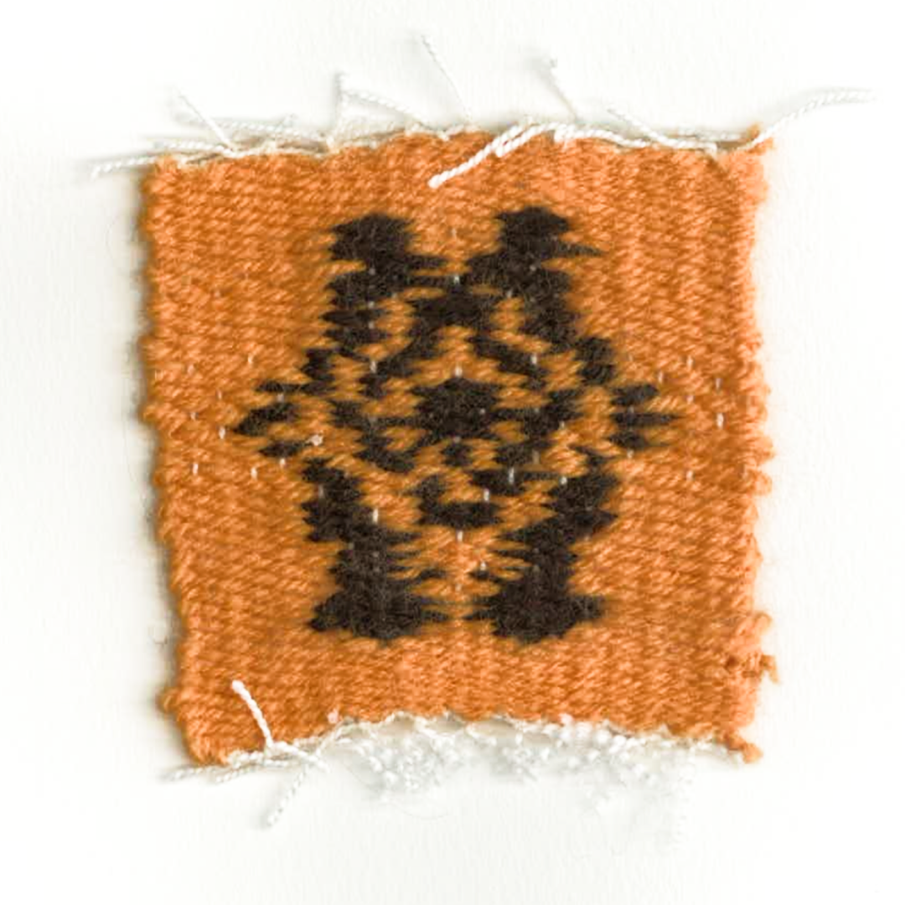

# Les origines numérisées

**Comment la prolongation des arts traditionnels du monde turcique perdure à travers une pratique numérique ?**

Je me questionne sur comment les arts traditionnels du monde turcique se font perdurer à travers une pratique numérique. Mes recherches s’appuient sur les arts décoratifs qu’on peut retrouver dans les différents peuples turcs et de ce qui en a perduré jusqu’à nos jours. De plus, avec l'arrivée de la technologie, je souhaite entrelacer le traditionnel au numérique et par la suite observer comment cette culture se développe sous un nouveau registre. 
Ce peuple né dans les steppes d’Asie centrale, plus précisément dans les montagnes d’Altai 3000 avant J-C, a développé sa propre manière de vivre. Il est essentiel de comprendre la naissance d’une culture et sa diffusion à travers d’autres peuples. L’art, les traditions, les gènes ou le dialecte proviennent d’une même racine turque qui se sont par la suite propagé dans des peuples dépassant le continent asiatique.

### Compétences
Je travaille beaucoup sur l’interactivité sur de l’objet 3D, la visualisation d’un objet en réalité augmentée et sur du code créatif.

**Coding** 
10/20, J'ai encore du mal à comprendre le langage du code mais je peux quand même faire des réalisations en code. 

**GIT ET VERSIONNING**
0/20, Connaît pas

**INTERACTIVITÉ ET RENDU TEMPS RÉEL**
12/20, Je pense y arriver pour des projets dans unity mais je peux avoir du mal pour du code interactif

**GRAPHISME ET DESIGN D'INTERFACE**
14/20, J'ai bien des compétences dans le design graphique mais je dois approfondir mes recherches concernant le design de jeu numérique

**INSTALLATION ET MISE EN ESPACE** 
14/20, J'arrive à gérer mon espace mais je dois m’entraîner pour la mise en espace de gadget électronique 

**PRÉSENTATION ET ARGUMENTATION**  
14/20, Lorsque mon oral est préparé à l'avance je suis à l'aise pour parler devant du monde mais lorsque c'est de l’improvisation j'ai peur de pas trouver directement le bon mot. 

### Idées à développer  
- Code qui définie des formes ressemblant à des kilims
- Blender, modéliser un tapis oriental (travail de texture et de materiaux) pour faire en sorte de mettre en avant les formes dessus.
- Unity, AR, transformer un espace avec des objets virtuels
- Code et nouveau style graphique du kilim (pixel). Aide de chat gpt, savoir comment représenter les kilim d’une façon abstrait en code.
- Brodage de forme dans le style de tapis oriental turc
- Tissage de forme dans le style de tapis oriental turc

#  Avancement
### Expérimentation des symboles provenant des kilims  
En me concentrant sur les arts décoratifs turques, j’aborde le sujet du kilim, une méthode de tissage à plat où on retrouve des motifs. Elles sont dérivés de symboles utilisés autrefois pour informer, communiquer et transmettre des idées. Au fil du temps, ces signes sont devenus un élément important de la culture turque. 
**Dessin**  
*explication* +
*img*

Dessin traditionnel de kilim
sur un carnet format A3
Dessin de kilim déjà existant 
Imaginer des nouveaux kilims en dessin
Comprendre les types de symboles
Comprendre comment créer plusieurs assemblages à partir des mêmes formes

  
> dessin format 20 x 20cm, aquarelle et crayons de couleurs.

   
> dessin petit format 10 x 7cm, techniques mixtes. 

Dessin vectoriel de killim
*expilcation*    

> Union

>Elibelinde

> Bereket

> Scoprion mais avec même base

> Monster's feet

> Tarnak

> Eye

> Bukagi

> Bereket

Travail d'assemblage de forme 
Travail sur un style de pixel, rendre le kilim 

**IA experimentation**  
J’utilise l’IA pour générer des symboles de kilim que j’intègre ensuite dans différents projets. Ce processus examine si les technologies modernes peuvent imiter la création de motifs traditionnels et dans quelle mesure ces styles restent reconnaissables. Cependant, les dessins générés par l’IA introduisent souvent une divergence unique de la réalité, ce qui entraîne une réinterprétation fascinante des motifs traditionnels.

> Proposition de pattern kilim par une intelligence artificielle, Mid Journey 
> Utilisation de prompt "Generate me a symbol elibelinde of kilim" 
> Le paramètre “--tile” permet de créer une image qui pourra se répéter

> prompt
> 

### IA critique
Voir les connaissances de l'IA au sujet des kilim

### Wave function 
Code qui permet de faire répéter une image sur VS Code 
    https://www.youtube.com/watch?v=rI_y2GAlQFM
Utilisation de mes dessins vectoriels pour le faire répéter en code 
Utilisation des motifs générer par IA pour le faire répéter en code 

Mon travail sur le Wave Function Collapse:  
https://etz223.github.io/wavefunction/wavefunctioninterface/

### Artistes references  

**Chloe Bensahel** est une artiste franco-américaine travaillant autour des relations entre les croyances, les matériaux, le texte et le textile. 
Inspirée par sa propre histoire intergénérationnelle de migration entre le Maghreb, la France et les États-Unis, son travail examine comment les matériaux peuvent véhiculer des histoires à la manière des corps souvent dissimulés sous forme de langage incarné ou codé. Elle utilise des techniques de tissage traditionnelles en les mélangeant à des technologies modernes créant ainsi des installations interactives qui répondent à la lumière et au toucher. 

Transplants, 2021  
Dans cette série nommée Transplants, elle imagine des récits autour des matériaux “exotiques” envahissants, des plantes déplacées qui parviennent néanmoins à fleurir et à se déplier. 
Elle imagine des récits où les matériaux exotiques envahissent l’espace. Ses tapisseries racontent des histoires différentes abordant le sujet de l’épanouissement, la dislocation ou même l’expression sensoriel de la plante. 

**Ahmed Faig** utilise des techniques mêlant l’artisanat traditionnel aux outils numériques. 
Il intègre des motifs de tapis anciens dans des compositions modernes, souvent réinterprété à l'aide de logiciels et de procédés innovants pour explorer l'esthétique et la symbolique culturelle.

**Ramazan Can** est un artiste contemporain où son travail s’appuie sur la transformation et la réinterprétation des tapis traditionnels d’Orient.
En intégrant des leds sur les kilims, il joue sur la temporalité de l’objet et nous montre un nouveau moyen de le détourner.  

En utilisant des codes informatiques et des panneaux LED, **Cem Sonel** explore de nouvelles techniques de production à l’intersection des nouveaux médias et du street art. En établissant un lien moderne entre la technologie, l'existence et le sens, Sonel souhaite questionner de manière analytique les similitudes entre le néant, l'existence et la non-existence.

### Accrochage 

> Aide de Bastien afin de bien définir l'emplacement de chaque motif en élaborant des catégoris.

### Tissages

  
 

> Tissage à partir des modèles des symboles véctorisés

**Sujet de recherches d’un autre camarade**  

Prendre le sujet de quelqu’un d’autre m’a permis d’approfondir une thématique sur laquelle je n’avais jamais pris le temps de faire des recherches.  

**Contexte**  
Mes grands-parents maternels ont immigré en France dans les années 80 et ont dû apprendre une nouvelle langue tout en essayant de conserver leur langue maternelle. 
Cependant, il est très difficile de comprendre et de parler une nouvelle langue lorsqu’on est illettré ou analphabète, comme c’est le cas de ma grand-mère.  

J’ai souvent observé les difficultés auxquelles elle faisait face lors de ses échanges avec ses voisines, elles-mêmes immigrées de divers pays comme le Maroc, le Portugal ou le Liban. 
J’apprécie beaucoup cette diversité culturelle qui permet de discuter avec des personnes de tous horizons et d’apprendre sur leurs cultures respectives. 
Je voudrais trouver une solution pour faciliter les échanges entre les personnes ayant des difficultés supplémentaires afin qu’elles ne soient pas exclues de ces discussions.  

**Idée**  
Mon idée est de créer une application de traduction destinée à des échanges spontanés. 
Cette application serait également adaptée aux personnes ayant du mal à manipuler un téléphone ou à comprendre son fonctionnement, 
comme les personnes âgées ou à mobilité réduite.  

L’interface doit être la plus simple possible, sans écriture, afin de ne pas compliquer l’utilisation pour les personnes illettrées ou analphabètes. 
Les consignes pourraient être transmises par audio ou par des images.
L’objectif principal est de proposer une traduction autonome, limitant au maximum les commandes nécessaires pour les utilisateurs.  

**Sujet de recherche**  
Mon idée est en lien avec le sujet de recherche de Valérie sur l’utilisation de l’IA au quotidien.
Je voulais explorer les capacités actuelles de l’IA pour évaluer la faisabilité de concevoir une telle application.

Lien pour voir les échanges avec l'aide de ChatGPT :  
https://drive.google.com/drive/folders/133gYCp3KrFpMIJVp0k1zx2G0NHu9E1UW?usp=drive_link

ChatGPT, par exemple, fonctionne mieux lorsque les consignes sont claires et détaillées, mais il peut également présenter des dysfonctionnements qui perturbent les échanges. 
Il est essentiel de comprendre et de s’adapter au rythme de la discussion, car l’IA peut répondre trop rapidement, interrompre la conversation, ou au contraire répondre avec du retard.
Bien que l’intelligence artificielle puisse offrir une solution intéressante pour la traduction, elle n’est pas encore entièrement adaptée à mes exigences pour ce projet.  
  
### Discussion + Aide 

**Bastien** + ref donné par Bastien 
**Valérie** 
**Lita** m’a conseillé d’utiliser Claude, une intelligence artificielle où sa spécialité est le codage.
J'ai conseillé à **Anne-Sophie** de regarder le travail de Sougwen Chung. Travail entre l'homme et la machine.
**Hind** a lié mon projet de symbole avec les symboles Amazigh, on retrouve également un travail de mémoire et de narration.

